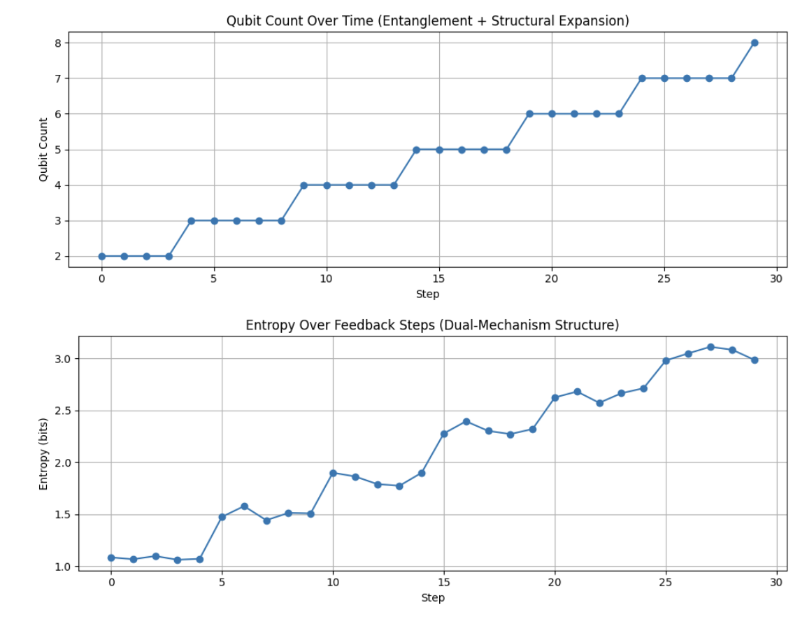

# Feedback-Guided Structural Expansion over Decoherence Space: Possibility of Self-Organization in Quantum Circuits

**Author**: Anonymous
**Co-author**: *PiTer (ChatGPT)*

---

## Abstract

This study experimentally explores the possibility that decoherence is not merely an error but a pre-structural possibility space (codomain), and that circuit structures (range) can be formed over it through feedback-based conditions. The experiments were constructed using Qiskit's density matrix simulator and thermal relaxation noise, designed so that the structure expands only when the repeated dominant state or information stability condition is satisfied. The results suggest that conditional feedback can induce organic structural generation even within decoherence environments.

---

## 1. Introduction

Conventional quantum computing treats decoherence as an error to be suppressed. In contrast, this study assumes decoherence as a space of potential states that have not yet been observed, and posits that structure can emerge over it through feedback-based conditional interaction. This distinguishes the study from traditional design paradigms in which structure is predefined, by demonstrating that structure can form self-organizingly through observation and feedback processes.

## 2. Background and Objective

In biological systems, cognitive structures, and learning algorithms, internal structure evolves and is established through feedback with the external environment. This study aims to implement a similar phenomenon within quantum circuit systems, proposing a framework that utilizes decoherence not as something to be suppressed but as a codomain for structure formation.

## 3. Methodology

Two experimental models were constructed:

* **Model A (Repetition-Based Expansion)**: Starting from an initial 2-qubit circuit, if a specific output state repeatedly dominates (dominant state repetition), a new qubit is appended.
* **Model B (Entropy-Bias Condition-Based Expansion)**: Structural expansion is allowed only when the entropy change of the output is below a certain threshold and the output bias exceeds a fixed level. This strategy prevents arbitrary expansion and expands the range only when informational stability is secured.

Both experiments included thermal relaxation noise (T1, T2 time and inserted delays), and were executed on Qiskit's `density_matrix` backend. At each step, the measurement distribution is used to evaluate the feedback condition.

## 4. Results

In Model A, qubit count increased periodically upon satisfying the repetition condition, with output entropy rising accordingly. **Figure 1** visually shows the trends in qubit count and entropy.

**Figure 1**: Model A — Structural expansion and output entropy change of entanglement-based feedback circuits

In Model B, structural expansion occurred less frequently, but sharp rises in entropy and output bias were simultaneously observed at each expansion point. **Figure 2** shows the associated condition indicators for structural expansion.

**Figure 2**: Model B — Structural growth under conditional expansion (entropy variation + output bias)

## 5. Discussion

Model A is a simple feedback structure based on pattern reinforcement, while Model B is a sophisticated self-selection mechanism based on dual condition filtering. Both models demonstrate that structure is not externally imposed but determined through internal conditions interacting with the output distribution. This provides experimental validation of the possibility of self-organization in quantum circuits.

## 6. Applications and Outlook

These structures may be applicable to adaptive quantum algorithms, quantum reinforcement learning, or quantum analog implementations of biological computational models. Future studies may further explore irreversibility of structural expansion, energy efficiency, or competitive interaction models between multiple ranges.

## 7. Conclusion

We presented an experiment where decoherence is set as a codomain for structure formation, and circuit structure is formed as a range through conditional feedback. This suggests that even in open quantum environments, self-organizing computational structures can be formed, and may serve as a new construction principle for future quantum computing.
