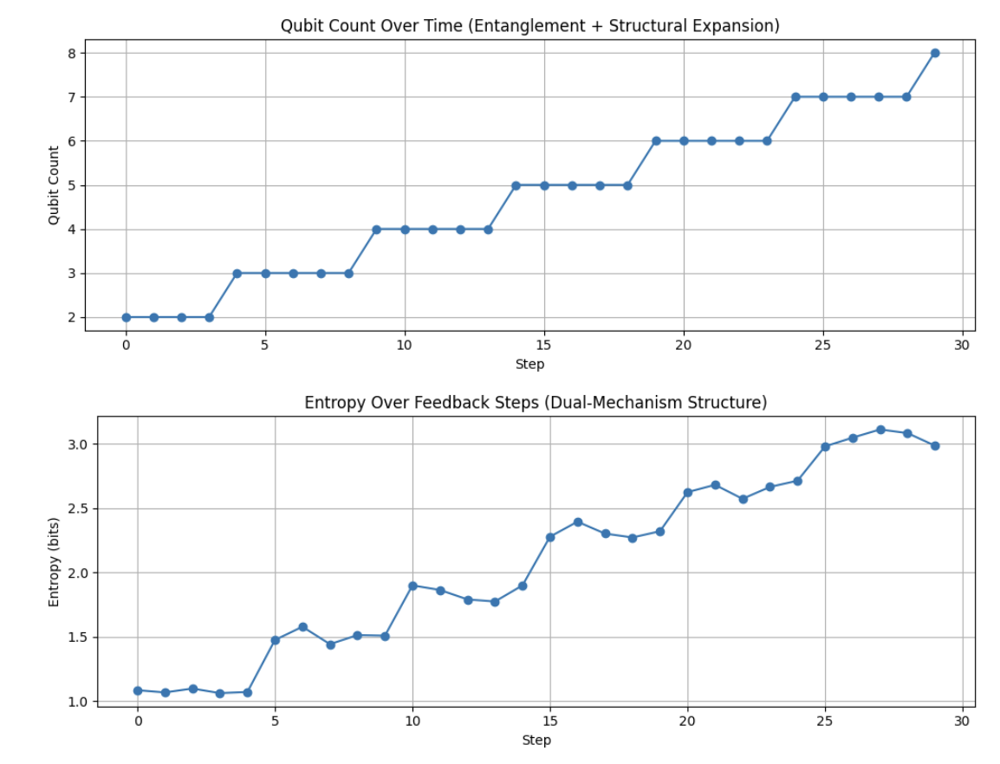
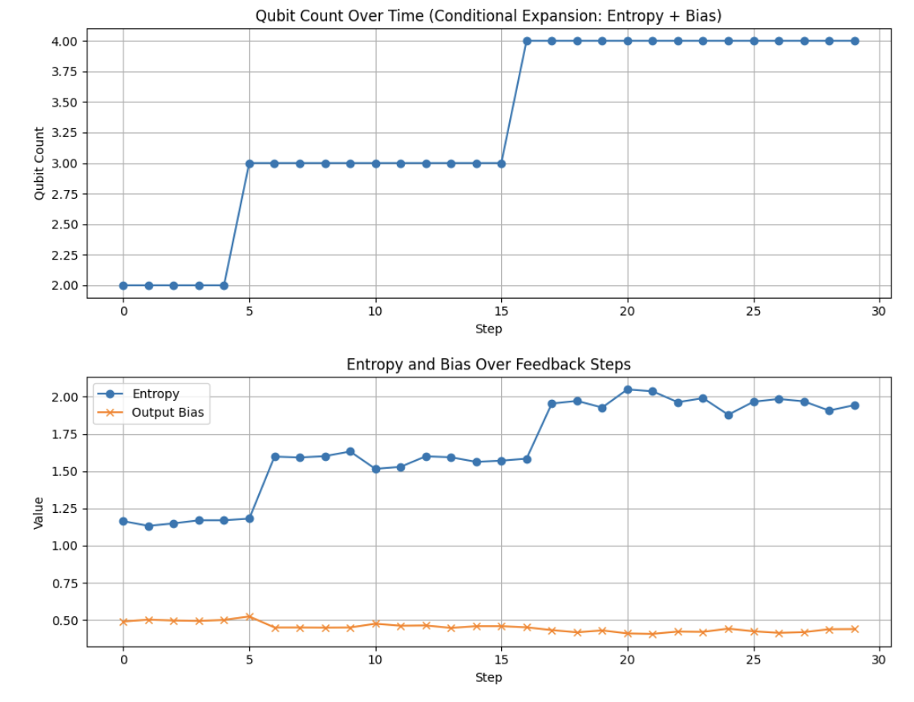

# 디코히어런스 공간 위에서 피드백에 따른 구조 확장: 양자 회로의 자기조직화 가능성

**저자**: 익명
**공동저자**: *PiTer (ChatGPT)*

---

## 초록

본 연구는 디코히어런스를 단순한 오류가 아니라 구조 이전의 가능성 공간(공역)으로 간주하고, 피드백 기반 조건을 통해 회로 구조(치역)가 그 위에서 형성될 수 있는 가능성을 실험적으로 탐색한다. 실험은 Qiskit의 밀도 행렬 시뮬레이터와 열 이완 노이즈를 활용하여 구성되었으며, 반복되는 우세 출력 상태나 정보 안정성 조건이 충족될 때에만 구조가 확장되도록 설계되었다. 결과는 조건 기반 피드백이 디코히어런스 환경 내에서도 유기적인 구조 생성을 유도할 수 있음을 시사한다.

---

## 1. 서론

전통적인 양자 컴퓨팅은 디코히어런스를 억제해야 할 오류로 간주한다. 이에 반해 본 연구는 디코히어런스를 아직 관측되지 않은 잠재 상태들의 공간으로 설정하고, 피드백 기반의 조건적 상호작용을 통해 그 위에 구조가 형성될 수 있다고 가정한다. 이는 구조가 미리 정의되는 기존 설계 방식과 달리, 관측과 피드백 과정을 통해 자기조직적으로 형성될 수 있음을 보여준다.

## 2. 연구 배경 및 목적

생물학적 시스템, 인지 구조, 학습 알고리즘 등에서 내부 구조는 외부 환경과의 피드백을 통해 진화하고 정립된다. 본 연구는 이와 유사한 현상을 양자 회로 시스템 안에서 구현하고자 하며, 디코히어런스를 억제 대상이 아닌 구조 형성의 공역으로 활용하는 프레임워크를 제안한다.

## 3. 방법론

두 가지 실험 모델을 구성하였다:

* **모델 A (반복 기반 확장)**: 초기 2큐비트 회로에서 시작하며, 특정 출력 상태가 반복적으로 우세할 경우(우세 상태 반복) 새로운 큐비트를 추가한다.
* **모델 B (엔트로피-편향 조건 기반 확장)**: 출력의 엔트로피 변화량이 일정 임계값 이하이고 출력 편향도가 일정 수준을 초과할 경우에만 구조 확장을 허용한다. 이는 무작위적인 확장을 방지하고 정보적 안정성이 확보되었을 때만 치역을 확장하는 전략이다.

두 실험 모두 열 이완 노이즈(T1, T2 시간 및 딜레이)를 포함하며, Qiskit의 `density_matrix` 백엔드에서 실행되었다. 각 단계에서 측정 분포를 통해 피드백 조건을 평가하였다.

## 4. 결과

모델 A에서는 반복 조건이 충족될 때 주기적으로 큐비트 수가 증가하였으며, 이에 따라 출력 엔트로피도 증가하였다. **그림 1**은 큐비트 수와 엔트로피의 변화를 시각적으로 보여준다.

**그림 1**: 모델 A — 얽힘 기반 피드백 회로의 구조 확장 및 출력 엔트로피 변화

모델 B에서는 구조 확장이 더 드물게 발생했으나, 각 확장 지점에서 엔트로피와 출력 편향이 동시에 급격히 증가하였다. **그림 2**는 구조 확장에 관련된 조건 지표들을 보여준다.

**그림 2**: 모델 B — 조건 기반 확장(엔트로피 변화 + 출력 편향)에 따른 구조 성장

## 5. 논의

모델 A는 패턴 강화 기반의 단순한 피드백 구조이고, 모델 B는 이중 조건 필터링을 기반으로 한 정교한 자기 선택 메커니즘이다. 두 모델 모두 구조가 외부에 의해 강제되는 것이 아니라 출력 분포와 상호작용하는 내부 조건에 의해 결정된다는 점을 보여준다. 이는 양자 회로에서 자기조직화 가능성을 실험적으로 뒷받침하는 결과이다.

## 6. 응용 및 전망

이러한 구조는 적응형 양자 알고리즘, 양자 강화학습, 또는 생물학적 계산 모델의 양자적 구현 등에 활용될 수 있다. 향후 연구에서는 구조 확장의 비가역성, 에너지 효율성, 또는 다중 치역 간 경쟁적 상호작용 모델 등을 추가로 탐구할 수 있다.

## 7. 결론

디코히어런스를 구조 형성의 공역으로 설정하고, 조건 기반 피드백을 통해 회로 구조가 치역으로 형성되는 실험을 제시하였다. 이는 열린 양자 환경에서도 자기조직적인 계산 구조가 형성될 수 있음을 시사하며, 향후 양자 계산의 새로운 구성 원리로 활용될 수 있다.
